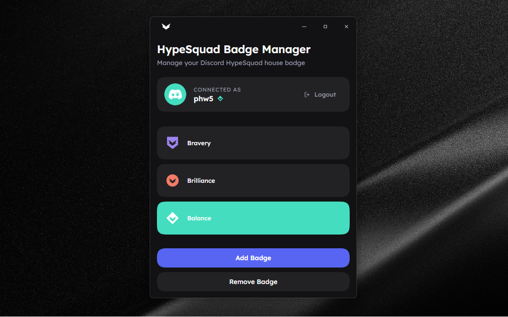

# Discord HypeSquad Badge Manager

<p align="center">
  Desktop utility for viewing and updating Discord HypeSquad house badges.
</p>

<p align="center">
  
  
  
  
</p>

<p align="center">
  Electron rebuild of a small HypeSquad badge manager based on <a href="./REBUILD_SPEC.md">REBUILD_SPEC.md</a>.
</p>

<p align="center">
  
</p>

## Install

For development:

```bash
npm install
```

If your npm setup blocks install scripts, approve Electron's postinstall:

```bash
npm approve-scripts electron electron-winstaller
```

Run the desktop app:

```bash
npm start
```

## Desktop UI

The desktop UI includes:

- custom frameless Electron title bar with working window controls
- token-based Discord session flow
- current user profile display with avatar and badge
- Bravery, Brilliance, and Balance badge selection
- add and remove badge actions
- inline loading spinner inside the primary action button
- locally persisted token state between launches

## Scripts

```bash
npm start
npm run dev
npm test
npm run build
```

## Notes

- The app stores the Discord token in `localStorage` under the key `discord_token`.
- The Discord login capture flow exists in Electron IPC, but there is no visible renderer button for it.
- Badge selection preserves the original UI-to-API remap:
  - UI `1` -> API `3`
  - UI `2` -> API `1`
  - UI `3` -> API `2`

## Packaging

Windows packaging is configured through [package.json](./package.json) with `electron-builder` and currently targets:

- `nsis`
- `portable`
